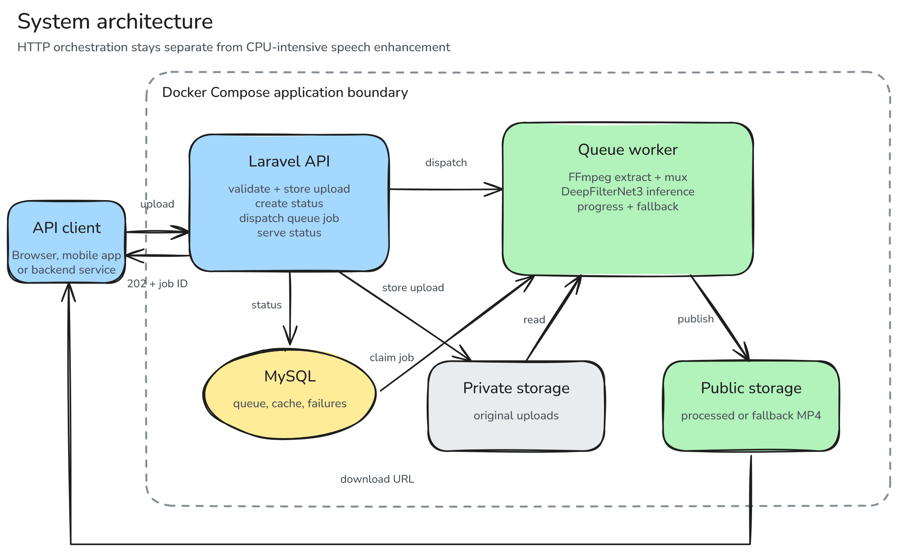
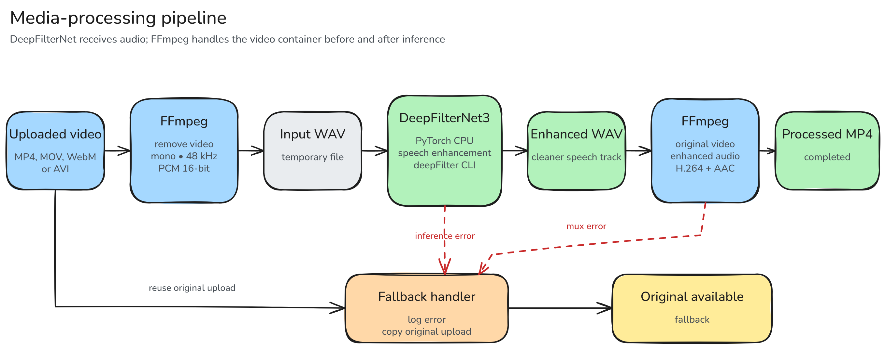

# AI Audio Noise Reduction API

An asynchronous speech-enhancement API for short-form video. The service extracts a video's audio track, enhances speech with the pretrained DeepFilterNet3 model, and returns a new MP4 file with the enhanced audio.

This project demonstrates model integration and serving rather than model training. DeepFilterNet is an open-source full-band speech-enhancement framework: <https://github.com/Rikorose/DeepFilterNet>.

## What it demonstrates

- A queue-based API that keeps expensive inference outside the HTTP request lifecycle
- A reproducible CPU inference environment using pinned Python, PyTorch, and DeepFilterNet versions
- A real video-to-audio-to-video media pipeline built with FFmpeg
- Explicit job states, progress reporting, failure logging, and graceful fallback
- Docker Compose services for the API, queue worker, and MySQL
- Feature and unit tests executed by GitHub Actions

## Architecture



The Laravel application handles uploads and status queries while a separate queue worker owns FFmpeg and model inference. See the [architecture documentation](docs/architecture.md) for deployment, lifecycle, and editable Excalidraw sources. The original [draw.io source](docs/diagrams/audio-noise-reduction-api.drawio) also remains available.

## Processing pipeline



If enhancement fails, the worker logs the internal error and exposes the original upload with a `fallback` status. Internal command output is not returned to API clients.

## Technology

| Layer | Technology |
|---|---|
| API | Laravel 13, PHP 8.5 |
| Queue and status storage | Laravel database queue and cache |
| Model | DeepFilterNet3 via DeepFilterNet 0.5.6 |
| Inference runtime | Python 3.11, PyTorch 2.2 CPU |
| Media processing | FFmpeg |
| Infrastructure | Docker Compose, MySQL |
| Verification | PHPUnit, GitHub Actions |

## Run locally

### Requirements

- Docker Desktop or Docker Engine with Compose
- Git Bash, WSL, Linux, or macOS for the commands below

### Setup

```bash
git clone https://github.com/gitnyaDanil/audio-noise-reduction-api.git
cd audio-noise-reduction-api

# Install Laravel Sail on the host-mounted project directory.
docker run --rm -v "$PWD:/app" -w /app composer:2 \
  composer install --ignore-platform-reqs --no-interaction

cp .env.example .env

./vendor/bin/sail build
docker compose run --rm laravel.test php artisan key:generate
./vendor/bin/sail up -d

./vendor/bin/sail artisan migrate --force
./vendor/bin/sail artisan storage:link
```

The Compose stack starts the HTTP application, the queue worker, and MySQL. The first image build is slow because it installs the CPU inference environment and model dependencies.

Verify the application:

```bash
curl http://localhost:8080/up
docker compose ps
```

## API

### Upload a video

```http
POST /api/upload
Content-Type: multipart/form-data
```

Accepted extensions: `mp4`, `mov`, `webm`, and `avi`. Maximum size: 100 MB by default.

```bash
curl -X POST http://localhost:8080/api/upload \
  -F "file=@sample.mp4"
```

Response:

```json
{
  "message": "File uploaded and queued",
  "job_id": "06b7ecf6-5d93-4348-81ce-1335cc539bb7",
  "status_url": "http://localhost:8080/api/upload/status/06b7ecf6-5d93-4348-81ce-1335cc539bb7"
}
```

### Check processing status

```bash
curl http://localhost:8080/api/upload/status/06b7ecf6-5d93-4348-81ce-1335cc539bb7
```

Completed response:

```json
{
  "job_id": "06b7ecf6-5d93-4348-81ce-1335cc539bb7",
  "status": "completed",
  "progress": 100,
  "message": "Noise reduction complete",
  "created_at": "2026-08-01T08:00:00+00:00",
  "updated_at": "2026-08-01T08:01:24+00:00",
  "download_url": "http://localhost:8080/storage/processed/06b7ecf6-5d93-4348-81ce-1335cc539bb7.mp4"
}
```

### Job states

| Status | Meaning |
|---|---|
| `pending` | Accepted and waiting for a worker |
| `processing` | Audio extraction or inference is running |
| `completed` | Enhanced MP4 is ready |
| `fallback` | Enhancement failed; original upload is available |
| `failed` | Enhancement and fallback both failed |

Status records expire after 24 hours by default.

## Tests

The automated tests cover upload validation, job dispatch, status lookup, successful processing orchestration, and fallback behavior. External FFmpeg and DeepFilterNet execution is isolated behind `AudioNoiseReducer`, so queue behavior can be tested without loading the model.

```bash
./vendor/bin/sail test
```

GitHub Actions runs the PHP tests on every push and pull request.

## Product and design documentation

- [Product requirements document](docs/PRD.md)
- [Architecture and deployment diagrams](docs/architecture.md)
- [ADR 0001: Process DeepFilterNet jobs asynchronously](docs/adr/0001-asynchronous-deepfilternet-processing.md)
- [Editable Excalidraw diagram sources](docs/diagrams/)
- [Editable multi-page draw.io source](docs/diagrams/audio-noise-reduction-api.drawio)

## Configuration

| Variable | Default | Purpose |
|---|---:|---|
| `NOISE_REDUCTION_MAX_UPLOAD_KB` | `102400` | Upload limit in KB |
| `NOISE_REDUCTION_PROCESS_TIMEOUT` | `600` | Timeout for each external process |
| `NOISE_REDUCTION_STATUS_TTL` | `86400` | Job-status retention in seconds |
| `FFMPEG_BINARY` | `ffmpeg` | FFmpeg executable |
| `DEEPFILTER_BINARY` | `deepFilter` | DeepFilterNet CLI executable |
| `DEEPFILTER_MODEL` | `DeepFilterNet3` | Pretrained model name or directory |

The database queue retry window is set above the worker timeout to prevent the same long-running job from being processed twice.

## Limitations

- DeepFilterNet3 enhances speech; it is not intended for music restoration or general source separation.
- CPU inference and video transcoding can be slow for long uploads.
- Job state is stored in cache rather than a dedicated persistent job-resource table.
- Processed and uploaded files are not yet deleted automatically.
- This repository integrates a pretrained model and does not claim to reproduce its published training metrics.

## Next improvements

1. Store jobs in a dedicated database table with ownership and retention metadata.
2. Delete expired source and output files through a scheduled command.
3. Add a small evaluation set with objective speech-quality and latency measurements.
4. Add object storage and signed download URLs.
5. Export queue depth, processing duration, failure rate, and fallback rate as monitoring metrics.

## Important files

| File | Purpose |
|---|---|
| `app/Http/Controllers/UploadController.php` | Upload and status API |
| `app/Jobs/ProcessNoiseReductionJob.php` | Queue lifecycle and fallback |
| `app/Services/AudioNoiseReducer.php` | FFmpeg and DeepFilterNet pipeline |
| `config/noise_reduction.php` | Pipeline configuration |
| `compose.yaml` | API, worker, and database services |
| `.github/workflows/tests.yml` | Continuous integration |
| `docs/PRD.md` | Product goals, requirements, metrics, and release criteria |
| `docs/architecture.md` | System, pipeline, deployment, and lifecycle diagrams |
| `docs/diagrams/*.excalidraw` | Canonical editable source for each architecture diagram |
| `docs/diagrams/*.png` | GitHub preview exported from the matching Excalidraw source at 2× scale |
| `docs/diagrams/audio-noise-reduction-api.drawio` | Original multi-page draw.io alternative |
