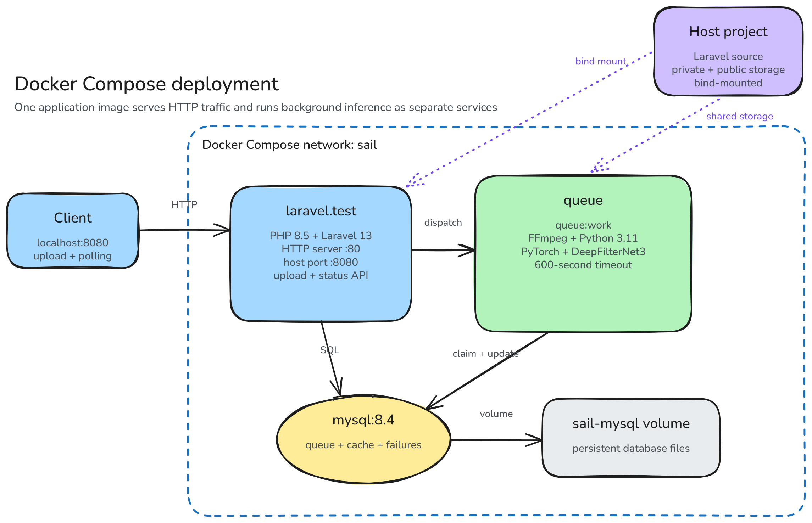
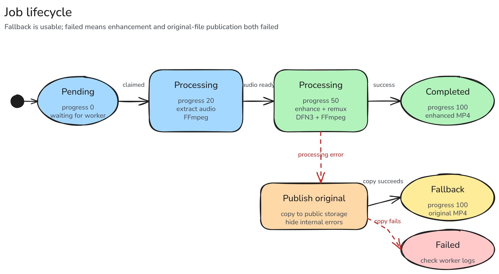

# Architecture

The `.excalidraw` files are the canonical diagram sources. Open them at [excalidraw.com](https://excalidraw.com/) or with the Excalidraw VS Code extension. After editing, export a 2× PNG with the background enabled and use the same base filename to refresh the GitHub preview. The original multi-page [`diagrams/audio-noise-reduction-api.drawio`](diagrams/audio-noise-reduction-api.drawio) remains available as an alternative editable format.

## System architecture

The HTTP application owns validation and status responses. Expensive media work runs in a separate queue worker. The application and worker share database-backed queue and cache data plus Laravel storage.

[Edit the system architecture in Excalidraw](diagrams/system-architecture.excalidraw)

## Media-processing pipeline

DeepFilterNet3 receives a 48 kHz WAV file, not a video container. FFmpeg provides the extraction and final video assembly around the model.

[Edit the media pipeline in Excalidraw](diagrams/media-processing-pipeline.excalidraw)

## Docker deployment

Docker Compose runs the Laravel application, queue worker, and MySQL on one network. The application source and Laravel storage are mounted into both PHP containers. The MySQL data uses a named volume.

[Edit the Docker deployment in Excalidraw](diagrams/docker-deployment.excalidraw)

## Job lifecycle

The fallback state is a successful terminal response that exposes the original video. The failed state is reserved for cases where both enhancement and fallback fail.

[Edit the job lifecycle in Excalidraw](diagrams/job-lifecycle.excalidraw)

## Design record

[`adr/0001-asynchronous-deepfilternet-processing.md`](adr/0001-asynchronous-deepfilternet-processing.md) records why the project uses queue-based processing and an explicit FFmpeg/DeepFilterNet pipeline.
